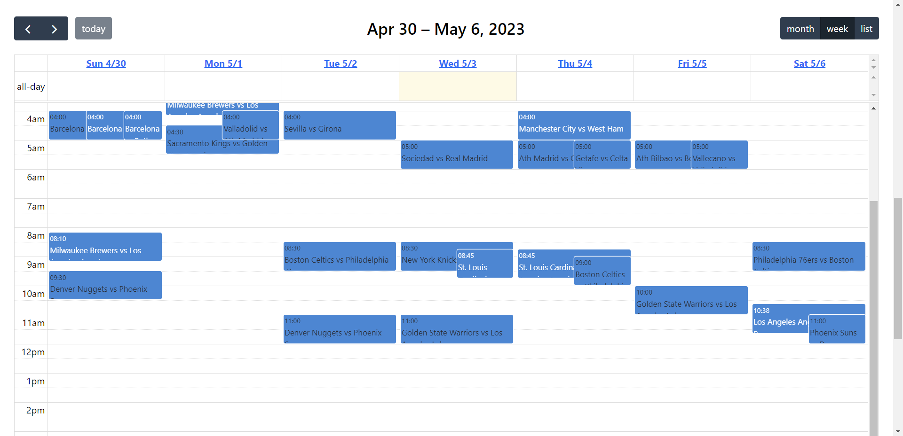

<p align="center">
  
</p>


# <div align="center"> Twin shot is a web application that helps you keep up to date with your favourite sports teams and leagues. </div>
<br>
<br>


# Live Demo

[Youtube video](https://youtu.be/ehJdRiQPOB4)

## Table of Contents
- [Introduction](#introduction)
- [Features](#features)
- [Explanation of application (with images)](#explanation-of-application-with-images)
- [Getting Started](#getting-started)
    - [Setup](#setup)
    - [How to set up knexfile](#how-to-set-up-knexfile)
- [Resources](#resources)
- [Contributors](#contributors)

# Introduction  
[TwinShot](https://twin-shot.onrender.com/) is an application created to give users one location to find and keep up to date with the games and results of their favourite teams and leagues. Instead of having to check different applications for all the differnets teams they follow, they can simply save their favourite teams and leagues and check out when they play, how did they do in their last games, and discover new teams to follow.  
<br>
[TwinShot](https://twin-shot.onrender.com/) uses javascript with react and react-bootstrap to render responsive UI/UX and runs a node.js server and a postgresql database.  


# Features
* Uses Football API and The Sports Database to ensure only the latest data is displayed.
* Be able to check out teams and leagues even without registering as a user.
* Search teams by name.
* Allows users to create a profile to easily save teams and leagues as their favourties and save time the next time they want to check future games or the results of past games.
* Finds data pertaining to games as the game stats, lineups and substitutions. 

# Explanation of application (with images)

### Homepage
Users are initailly shown a form where they can register as a new user, login or continue as guests if they don't feel like creating a user.
<p align="center">  </p>
<hr>

### Search for leagues as a guest
Users are able to choose a league from the predetermined leagues available.
<div align="center" style="display:flex;flex-direction:row">   </div>
<hr>

### Search for teams as a guest
Users are able to choose teams from their respective leagues.
<p align="center">  </p>


They are also able to search for teams directly.
<p align="center">  </p>
<hr>

### Display of games for a guest
Once the user has chosen the league or teams they want to see the past and future games of, they are shown a calendar view for the information of the selected leagues/teams.
<div align="center" style="display:flex;flex-direction:row">   </div>
<hr>


### Display game stats and information
Users can then select the game they want to see the stats for and a modal will show up with all the game information.
<p align="center">  </p>
<hr>


### Profile View
If a user decided to register, they are then able to save different teams and/or leagues to their profile and they will see future games or the results of past games directly when they signin.
<p align="center">  </p>
<hr>

### Display of games for a user
Once the user has chosen the league or teams they want to save as their favourites, they are able to see all their future games or the results of past games at the bottom of their profile page.
They are also able to change the display of the calendar to monthly, weekly or daily.
<div align="center" style="display:flex;flex-direction:row">   </div>
<hr>

### Display game stats and information
Users can also select the game they want to see the stats for and a modal will show up with all the game information.
<p align="center">  </p>
<hr>


# Getting Started
### ‼️ Things you will need:
* Install [postgresql](https://www.postgresql.org/)
* Get an api key from [API FOOTBALL](https://dashboard.api-football.com/register) and [The Sports Database](https://www.thesportsdb.com/api.php)  

# Setup
Begin by running the following command in the root folder to install dependencies  
```
npm install
```  
Next, create a postgresql database  
```
psql
CREATE DATABASE <db_name>
```  
After your database is created and running, run the following commands to create database and add seed data  
```
npm run migrate:latest
npm run seed:data
```  
To start the server, run the following command  
```
npm start
```  
Next run the following commands to change directory to ```./frontend``` and install npm dependencies for react  
```
cd frontend
npm install
```  
Finally, to start the react app run the following command in ```./frontend```  
```
npm start
```  
# How to set up knexfile  
```knexfile.js``` can be find at the following path from the root folder: ```./backend/db```  

You will need to set up a ```.local.env``` file in the root folder which contains the following variables:  
```
API_KEY=<YOUR SECRET API KEY>
API_URL=https://v3.football.api-sports.io
API_HOST=v3.football.api-sports.io
DB_USER=<your_db_username>
DB_NAME=<your_db_name>
DB_PASSWORD=<your_db_password>
NODE_ENV=development
SECRET_TOKEN=<YOUR SECRET TOKEN FOR JWT>
```  
You will also want to add your ```.local.env``` to the ```.gitignore``` file in the root folder to avoid your sensitive data from being pushed to github 


# Resources

- [Node.js](https://nodejs.org/en/)
- [express](https://expressjs.com/)
- [knex](https://knexjs.org/)
- [jsonwebtoken](https://jwt.io/)
- [connect-timeout](http://expressjs.com/en/resources/middleware/timeout.html)
- [React](https://reactjs.org/)
- [React Bootstrap](https://react-bootstrap.github.io/)
- [Moment.js](https://momentjs.com/)


# Contributors
Feel free to check out my github page and see what other projects I have worked on! 😎
<table>
  <tr>
    <td align="center"><a href="https://github.com/calss0t"><br /><sub><b>Pol Texido</b></sub></a></td>
  </tr>
</table>


